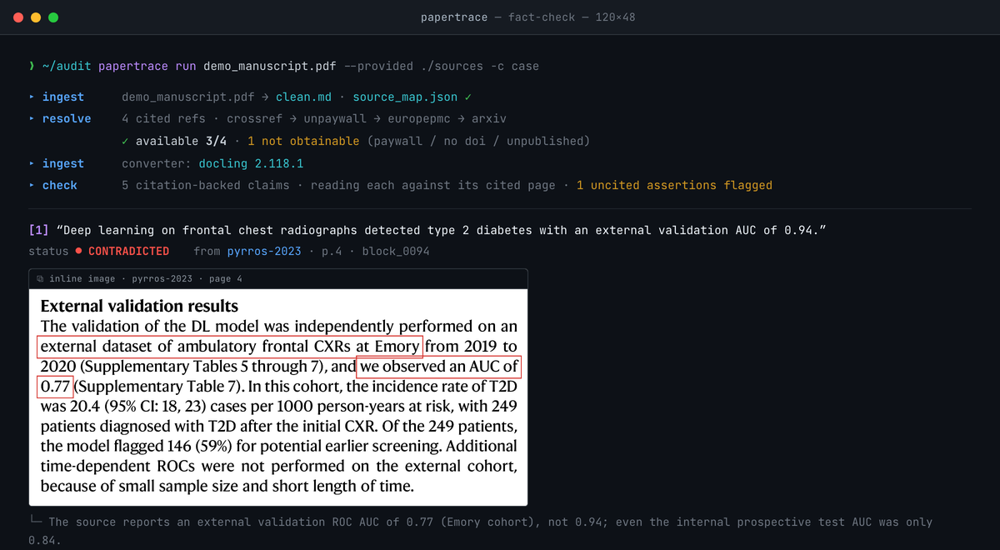

<p align="center">
  
</p>

<h1 align="center">PaperTrace</h1>

<p align="center"><b>Check what a scientific paper claims against what its cited sources actually say.</b></p>

<p align="center">PaperTrace retrieves legally available cited PDFs, checks the paper's high-value<br>
citation-backed claims against the actual source pages, and shows the evidence —<br>
the matched text boxed in red on the real page.</p>

<p align="center"><b>An unread source never receives a verdict.<br>
A missed citation is reported, not silently skipped.</b></p>

<p align="center">
  <a href="examples/demo/output/report.md">See a completed report</a> ·
  <a href="#quick-start">Quick start</a> ·
  <a href="#how-it-works">How it works</a> ·
  <a href="#ethics--scope">Ethics &amp; scope</a> ·
  <a href="https://github.com/defraction0/PaperTrace/releases/latest">v0.3.0 (beta)</a>
</p>

<p align="center"><sub>Open source · runs locally · Python 3.10+ · <a href="https://claude.com/claude-code">Claude Code</a> currently required · built for published papers</sub></p>

<p align="center">
  <a href="examples/demo/output/report_terminal.png"></a>
</p>

---

> **See the result first — no install needed.** The demo report committed at
> [`examples/demo/output/report.md`](examples/demo/output/report.md) audits a
> fictional mini-review with planted citation errors and real, published
> references: **2 supported · 2 contradicted · 1 not retrieved · 1 uncited
> assertion** — the planted errors, and exactly them.

Pick a paper that matters to you — the landmark your project builds on, the
method paper you are about to adopt, your own published work. PaperTrace
answers three questions about it: **do its citations say what it claims they
say?** — **what has been published since?** — **what existed at the time but
went uncited?**

## What it does — and what it does not

**PaperTrace does**

- Retrieve what the paper cites through legal open-access routes only
  (Crossref → Unpaywall → Europe PMC → arXiv) — and reject a downloaded PDF
  that doesn't look like the cited paper (title sanity check), rather than
  judge claims against the wrong text.
- Check the paper's high-value citation-backed claims against the actual
  text of the cited pages, with page-level provenance for every verdict.
- Show the evidence: real page crops with the matched text boxed in red —
  placed by text search, never by hand. Tables and figures included.
- Preserve unavailable sources as explicit gaps: a claim whose source
  couldn't be retrieved is `⊘ not retrieved` — recorded, never guessed.
- Deterministically report every citation label the checks did not cover,
  and register assertions carrying no citation at all.
- Disclose its ingest fidelity: every report is stamped with the converter
  that read the PDF, and a flat-text fallback says so loudly.
- Keep the human responsible for interpretation — it prepares evidence and
  drafts; the conclusions are yours.

**PaperTrace does not**

- Bypass paywalls — what it can't get legally, it reports as not obtainable.
- Treat model memory as evidence — verdicts come only from retrieved or
  user-provided pages.
- Check literally every citation-bearing sentence — it selects high-value
  claims, then tells you exactly which citation labels were not covered.
- Prove that an uncited article *should* have been cited — scout hits are
  candidates for your judgement, never accusations.
- Guarantee an exhaustive literature search — the scout is search-based, and
  absence from its lists proves nothing.
- Replace peer review or your research judgement.

## Quick start

### Interactive — the `/review` skill (recommended)

```bash
git clone https://github.com/defraction0/PaperTrace && cd PaperTrace
pip install -e ".[full]"     # standard install — layout-aware ingest
claude                       # start Claude Code here
> /review
```

*(First run of the layout backend downloads docling's models — ~500 MB, once.
On a constrained machine, `pip install -e .` gives the light flat-text core.)*

The interactive audit interviews you: the paper's PDF, any reference PDFs you
already have — and, if you are using it for peer review, screenshots of your
journal's reviewer form, which it reads and answers question by question.
Then it retrieves, checks, crops, and drafts, showing you evidence as it goes
and batching its questions.

### Batch — one command, markdown out

```bash
pip install -e ".[full]"        # standard install (see matrix below)
export PAPERTRACE_EMAIL="you@example.org"     # Unpaywall asks for a contact
papertrace run paper.pdf --provided ./my_pdfs -c case
```

Install options:

| Command | What you get |
|---|---|
| `pip install -e ".[full]"` | ⭐ **standard install** — layout-aware ingest (real tables, figures, lists) + PNG rendering. Pulls torch; first run downloads docling's layout models (~500 MB, once) |
| `pip install -e ".[docling]"` | layout-aware ingest only |
| `pip install -e ".[png]"` | PNG report rendering only |
| `pip install -e .` | minimal core — flat-text ingest. For CI and constrained machines; every report will carry a "tables linearized" warning |

`--backend auto` (default) uses docling when installed and falls back to flat
text otherwise — and the report always says which one ran, because a
linearized table is a degradation worth disclosing.

Output in `case/out/`: `report.md` with inline evidence images, the same
report as a dark **editor-window** page and as a **terminal-run** page
(`report_editor.html`, `report_terminal.html`), plus machine-readable
`results.json`, `scout.json` and the retrieval manifest. The scout step is on
by default (`--no-scout` to skip); pass `--doi` if the title lookup picks the
wrong paper. Want shareable PNG images of the report looks? Add `--png`
(one-time setup: `playwright install chromium`).

**One case folder per paper.** `case` is only the default name — give each
paper its own (`papertrace run zhang2025.pdf -c zhang2025`). Re-running the
same paper into its case is fine; pointing a *different* paper at a used
case is refused, so two audits can never mix.

Batch checking runs on headless Claude Code (`claude -p`) — it inherits your
existing login, **no API key to configure**. Every other step (ingest,
retrieval, scout, crops, reports) is deterministic Python.

## What a real run looks like

A real, unscripted audit of a published paper (Zhang et al., *Nature Mental
Health* 3, 1168–1180, 2025 —
[doi:10.1038/s44220-025-00501-8](https://doi.org/10.1038/s44220-025-00501-8)):
86 cited references, of which 22 had legal open-access copies — the other 64
are recorded as not obtainable, never guessed. 15 high-value claims were read
against their cited pages: **8 supported, 7 partial, 0 contradicted**. The
partials are the interesting part — a Methods sentence calling tests
"well-established" whose own cited source describes them as "brief and
bespoke, non-standard", and multi-reference claims where the retrieved source
carries one half of the claim while the unretrieved co-citation is *named* as
the possible carrier of the other half. Candidates for your judgement, not
accusations.

<p align="center">
  <a href="docs/real_audit_terminal.png"></a>
</p>

## Tables and figures are evidence too

With the standard install, a claim that lives in a table cell or inside a
figure is found, checked, and shown like any other — cell and in-figure
numbers boxed by text search on the real page:

<p align="center">
  
</p>

## Try the demo yourself

The committed report above was produced by this exact sequence — a fictional
mini-review with **planted citation errors** and real, published references.
The resolver fetches the open-access sources live, then the checker catches
the plants: an AUC quoted as 0.94 where the cited paper says 0.77, an
attendance figure that contradicts the cited flow chart, a headline resting
on a paywalled source that is honestly reported as unverifiable, and one
assertive sentence with no citation at all.

The run takes about five minutes; the first time adds two one-time downloads
(chromium ~150 MB, docling's layout models ~500 MB). **Prerequisite:**
[Claude Code](https://claude.com/claude-code) installed and logged in — the
claim checker runs on `claude -p`.

```bash
pip install -e ".[full]" && playwright install chromium   # 1 · install
export PAPERTRACE_EMAIL="you@example.org"                 # 2 · Unpaywall contact
python examples/demo/make_manuscript.py                   # 3 · build the demo paper
papertrace run examples/demo/demo_manuscript.pdf -c demo_case   # 4 · audit it
```

When it finishes, open `demo_case/out/report.md`. Expected result:
**2 supported · 2 contradicted · 1 not retrieved**, one uncited assertion
flagged, all 4 citation labels covered. (The scout step reports the fictional
paper as *not identified* in Europe PMC — the tool would rather say so than
invent neighbours. Verdict wording can vary slightly run to run; the planted
errors are always caught.) Details per plant:
[`examples/demo/`](examples/demo/).

## How it works

```
paper.pdf ─────ingest──▶ clean.md + source_map.json       (page + bbox for every block)
      │
      └─refs──▶ refs_manifest.json                        (per-ref: retrieved / provided /
                + sources_resolved/*.pdf                    paywalled / mismatch / no_doi /
      │                                                     error + reason)
      └─scout─▶ out/scout.json                            (europe pmc: published-since +
                                                            existed-but-uncited candidates)
      │
      └─check─▶ results.json                              (per-claim verdict + page anchor;
                                                            unavailable source ⇒ not_retrieved)
      │
      └─highlight─▶ out/evidence/claim_NN.png             (red box on the matched text)
      │
      └─report──▶ report.md · report_editor.html/png · report_terminal.html/png
```

The JSON contracts are versioned in [`schemas/`](schemas/). The two skills in
[`.claude/skills/`](.claude/skills/) drive the same tools interactively; the
audit craft lives in [`prompts/review_core.md`](prompts/review_core.md).

## Ethics & scope

- **Built for published papers.** Everything PaperTrace reads is already
  public, so no confidentiality question arises in its primary use.
- **A note on peer review.** The interactive workflow also handles a full
  reviewer's job — reading the journal's form, checking the claims, drafting
  comments — and remains fully supported. But many journals prohibit sharing
  unpublished manuscripts with AI tools: if you use it on a manuscript under
  review, confirm your journal's policy first and disclose AI assistance
  where required. Case folders are gitignored by design and the repo's
  `.gitignore` refuses `*.pdf`/`*.docx` outright — whatever you audit stays
  local.
- **You are the judge.** The tool prepares evidence and drafts; the
  conclusions are yours. Scout hits are candidates, not accusations — verify
  before you act on any finding.
- **No paywall bypassing.** The resolver uses legal open-access routes only;
  what it can't get, it reports as not obtainable.
- **No verdict laundering.** An unread source can never yield a supported
  claim — `not_retrieved` is a first-class result and appears in every
  report. The scout is search-based and says so: absence from its lists
  proves nothing.

## Development

```bash
pip install -e ".[dev,png]"
pytest          # fixtures only — no network, no LLM
ruff check src tests scripts
```

See [`CONTRIBUTING.md`](CONTRIBUTING.md) for how to report paper-format
failures — the feedback that improves the tool fastest. The pixel logo is
generated: `python scripts/make_logo.py`. Changes are tracked in
[`CHANGELOG.md`](CHANGELOG.md); cite the tool via [`CITATION.cff`](CITATION.cff).

## Roadmap

- [ ] Retraction & correction flags on cited references
- [ ] Superscript citation styles in the coverage audit (bare trailing
      numerals, as in Nature-family journals — the report currently says
      "not audited" instead of silently passing)
- [ ] More scout backends (OpenAlex, Semantic Scholar)
- [ ] Support for other LLM backends (local and API models alongside
      headless Claude Code)
- [ ] Claude Desktop integration
- [ ] MCP server — drive PaperTrace as a tool from any MCP-capable client
- [ ] DOCX ingest
- [ ] Revision (R1) mode polish
- [ ] GROBID-grade reference parsing
- [ ] Figure-vs-text consistency pass (batch)
- [ ] PyPI release
- [ ] Journal review packs — may be added in the future

## License

Code is MIT. Prompts, skills and journal packs are CC BY-SA 4.0
(see `LICENSE-prompts`). Bundled fonts are SIL OFL 1.1.
