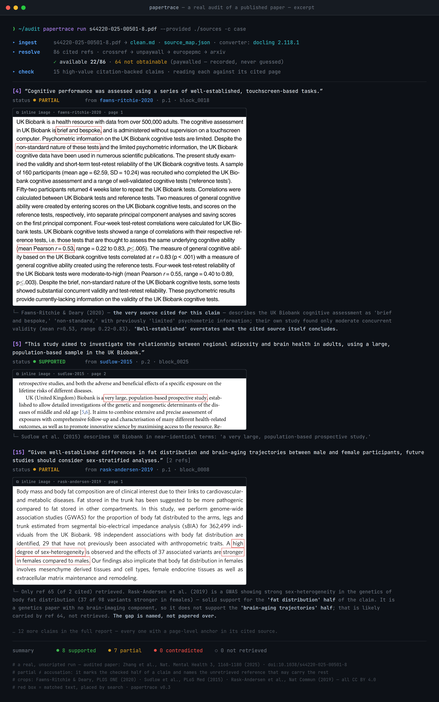
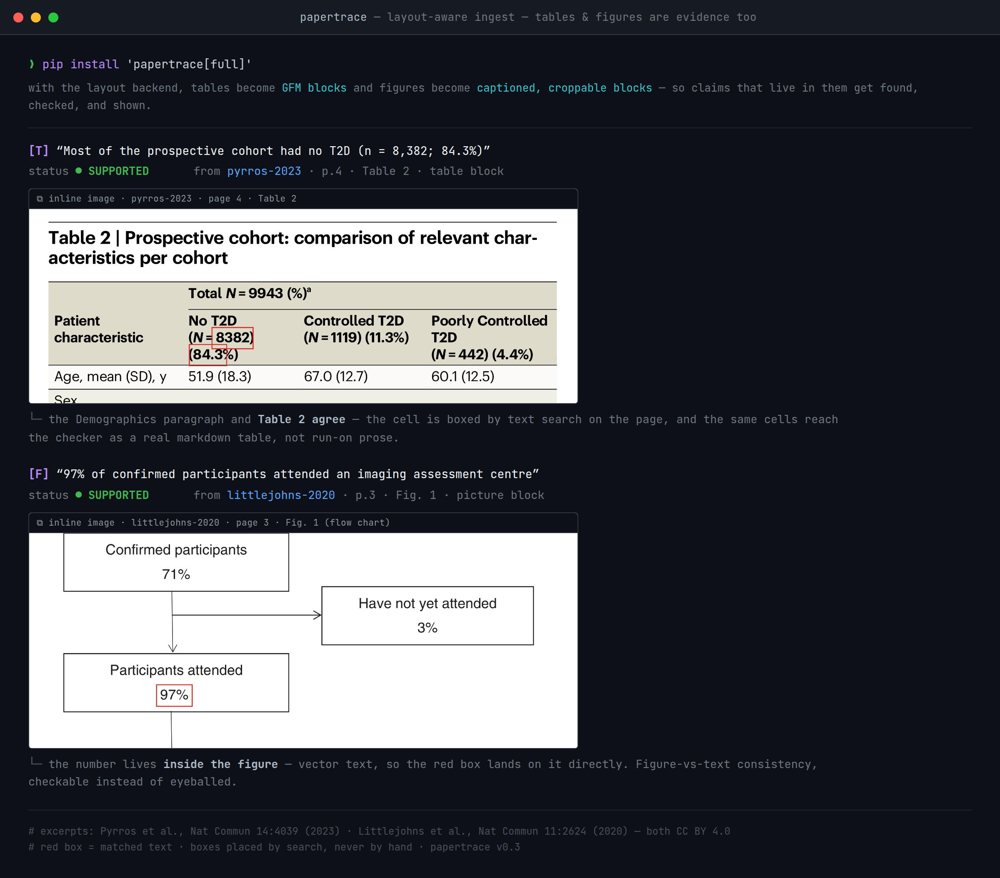

<p align="center">
  
</p>

<h1 align="center">PaperTrace</h1>

<p align="center"><b>Trace a published paper's claims back to what its cited sources actually say —<br>
then check it against the literature that came after.</b><br>
An agentic paper-audit tool. Your judgement stays in charge.</p>

<p align="center">
  
</p>

---

Pick a paper that matters to you — the landmark your project builds on, the
method paper you are about to adopt, your own published work. PaperTrace
answers three questions about it:

1. **Do its citations actually say what it claims they say?** Every
   citation-backed sentence, read against the real pages of its cited source.
2. **What has been published since?** Articles citing it, plus later keyword
   neighbours — the literature the paper could not have known.
3. **What existed at the time but went uncited?** Candidates that were in
   print by the paper's year and are absent from its reference list.

It works on **published papers by design** — no confidentiality question
arises, because everything it reads is already public. (Many journals
prohibit sharing unpublished manuscripts with AI tools; see
[Ethics & scope](#ethics--scope).)

What a run gives you:

- **Retrieves** what the paper cites (Crossref → Unpaywall → Europe PMC →
  arXiv, open access only) and tells you honestly what it couldn't get.
- **Reads** every citation-backed claim against the actual text of its cited
  source — with page-level provenance for every statement.
- **Shows** the evidence: real page crops with the matched text boxed in red,
  placed by text search, never by hand.
- **Reports** the gap: a claim whose source couldn't be retrieved is marked
  `⊘ not retrieved` — recorded, never guessed. *The gap is an output, not a
  silence.*
- **Scouts** the literature around the paper: what appeared after it and what
  existed but went uncited — as candidates for your judgement, never as
  accusations. Search-based, so absence from those lists proves nothing.
- **Audits itself**: a deterministic check compares every citation label in
  the text against the claims actually extracted ("labels 7, 12 unaddressed"),
  and assertions carrying **no** citation land in their own register for your
  judgement.
- **Discloses its ingest fidelity**: every run is stamped with the converter
  that read the PDF. The layout backend (docling) preserves tables, figures
  and lists; the flat fallback (PyMuPDF) says so, loudly, in the report.

## What a real run looks like

The excerpt above is from a real, unscripted audit of a published paper
(Zhang et al., *Nature Mental Health* 3, 1168–1180, 2025 —
[doi:10.1038/s44220-025-00501-8](https://doi.org/10.1038/s44220-025-00501-8)):
86 cited references, of which 22 had legal open-access copies — the other 64
are recorded as not obtainable, never guessed. 15 high-value claims were read
against their cited pages: **8 supported, 7 partial, 0 contradicted**. The
partials are the interesting part — a Methods sentence calling tests
"well-established" whose own cited source describes them as "brief and
bespoke, non-standard", and multi-reference claims where the retrieved source
carries one half of the claim while the unretrieved co-citation is *named* as
the possible carrier of the other half. Candidates for your judgement, not
accusations.

## Tables and figures are evidence too

With the standard install, a claim that lives in a table cell or inside a
figure is found, checked, and shown like any other — cell and in-figure
numbers boxed by text search on the real page:

<p align="center">
  
</p>

## Two ways to run it

### Interactive — the `/review` skill (recommended)

```bash
git clone https://github.com/defraction0/PaperTrace && cd PaperTrace
pip install -e ".[full]"     # standard install — layout-aware ingest
claude                       # start Claude Code here
> /review
```

*(First run of the layout backend downloads docling's models — ~500 MB, once.
On a constrained machine, `pip install -e .` gives the light flat-text core.)*

The interactive audit interviews you: the paper's PDF, any reference PDFs you
already have — and, if you are using it for peer review, screenshots of your
journal's reviewer form, which it reads and answers question by question.
Then it retrieves, checks, crops, and drafts, showing you evidence as it goes
and batching its questions.

### Batch — one command, markdown out

```bash
pip install -e ".[full]"        # standard install (see matrix below)
export PAPERTRACE_EMAIL="you@example.org"     # Unpaywall asks for a contact
papertrace run paper.pdf --provided ./my_pdfs -c case
```

Install options:

| Command | What you get |
|---|---|
| `pip install -e ".[full]"` | ⭐ **standard install** — layout-aware ingest (real tables, figures, lists) + PNG rendering. Pulls torch; first run downloads docling's layout models (~500 MB, once) |
| `pip install -e ".[docling]"` | layout-aware ingest only |
| `pip install -e ".[png]"` | PNG report rendering only |
| `pip install -e .` | minimal core — flat-text ingest. For CI and constrained machines; every report will carry a "tables linearized" warning |

`--backend auto` (default) uses docling when installed and falls back to flat
text otherwise — and the report always says which one ran, because a
linearized table is a degradation worth disclosing.

Output in `case/out/`: `report.md` with inline evidence images, the same
report as a dark **editor-window** page and as a **terminal-run** page
(`report_editor.html`, `report_terminal.html`), plus machine-readable
`results.json`, `scout.json` and the retrieval manifest. The scout step is on
by default (`--no-scout` to skip); pass `--doi` if the title lookup picks the
wrong paper. Want shareable PNG images of the report looks? Add `--png`
(one-time setup: `playwright install chromium`).

**One case folder per paper.** `case` is only the default name — give each
paper its own (`papertrace run zhang2025.pdf -c zhang2025`). Re-running the
same paper into its case is fine; pointing a *different* paper at a used
case is refused, so two audits can never mix.

Batch checking runs on headless Claude Code (`claude -p`) — it inherits your
existing login, **no API key to configure**. Every other step (ingest,
retrieval, scout, crops, reports) is deterministic Python.

## Try the demo

A fictional mini-review with **planted citation errors** and real, published
references — the resolver fetches the open-access ones live, then the checker
catches the plants: an AUC quoted as 0.94 where the cited paper says 0.77, an
attendance figure that contradicts the cited flow chart, a headline resting
on a paywalled source that is honestly reported as unverifiable, and one
assertive sentence with no citation at all.

The run itself takes about five minutes; the first time adds two one-time
downloads (chromium ~150 MB, docling's layout models ~500 MB).
**Prerequisite:** [Claude Code](https://claude.com/claude-code) installed and
logged in — the claim checker runs on `claude -p`.

Run these four steps **in this order**, each from the repo root, waiting for
one to finish before the next:

**1 · Install** (skip anything you've already done)

```bash
pip install -e ".[full]"
playwright install chromium
```

**2 · Set your contact email** — Unpaywall's API requires one; the run
refuses to start without it:

```bash
export PAPERTRACE_EMAIL="you@example.org"   # use your real address
```

**3 · Build the fictional demo paper** — wait for
`wrote … demo_manuscript.pdf` before continuing:

```bash
python examples/demo/make_manuscript.py
```

**4 · Run the audit** — retrieval ticker, claim checking, evidence crops,
reports:

```bash
papertrace run examples/demo/demo_manuscript.pdf -c demo_case
```

When it finishes, open `demo_case/out/report.md` — or the same report as
`report_terminal.html` / `report_editor.html`. Expected result:
**2 supported · 2 contradicted · 1 not retrieved**, one uncited assertion
flagged, all 4 citation labels covered — the planted errors, and exactly
them. (The scout step reports the fictional paper as *not identified* in
Europe PMC — the tool would rather say so than invent neighbours.) Details
per plant: [`examples/demo/`](examples/demo/).

## How it works

```
paper.pdf ─────ingest──▶ clean.md + source_map.json       (page + bbox for every block)
      │
      └─refs──▶ refs_manifest.json                        (per-ref: retrieved / provided /
                + sources_resolved/*.pdf                    paywalled / no_doi / error + reason)
      │
      └─scout─▶ out/scout.json                            (europe pmc: published-since +
                                                            existed-but-uncited candidates)
      │
      └─check─▶ results.json                              (per-claim verdict + page anchor;
                                                            unavailable source ⇒ not_retrieved)
      │
      └─highlight─▶ out/evidence/claim_NN.png             (red box on the matched text)
      │
      └─report──▶ report.md · report_editor.html/png · report_terminal.html/png
```

The JSON contracts are versioned in [`schemas/`](schemas/). The two skills in
[`.claude/skills/`](.claude/skills/) drive the same tools interactively; the
audit craft lives in [`prompts/review_core.md`](prompts/review_core.md) with
journal-specific packs in [`journal_packs/`](journal_packs/).

## Ethics & scope

- **Built for published papers.** Everything PaperTrace reads is already
  public, so no confidentiality question arises in its primary use.
- **A note on peer review.** The interactive workflow also handles a full
  reviewer's job — reading the journal's form, checking every claim, drafting
  comments — and remains fully supported. But many journals prohibit sharing
  unpublished manuscripts with AI tools: if you use it on a manuscript under
  review, confirm your journal's policy first and disclose AI assistance
  where required. Case folders are gitignored by design and the repo's
  `.gitignore` refuses `*.pdf`/`*.docx` outright — whatever you audit stays
  local.
- **You are the judge.** The tool prepares evidence and drafts; the
  conclusions are yours. Scout hits are candidates, not accusations — verify
  before you act on any finding.
- **No paywall bypassing.** The resolver uses legal open-access routes only;
  what it can't get, it reports as not obtainable.
- **No verdict laundering.** An unread source can never yield a supported
  claim — `not_retrieved` is a first-class result and appears in every
  report. The scout is search-based and says so: absence from its lists
  proves nothing.

## Development

```bash
pip install -e ".[dev,png]"
pytest          # fixtures only — no network, no LLM
ruff check src tests scripts
```

The pixel logo is generated: `python scripts/make_logo.py`.

## Roadmap

Superscript citation styles in the coverage audit (bare trailing numerals,
as in Nature-family journals, are currently not recognized — the report says
so instead of silently passing) · retraction & correction flags on cited
references · more scout backends (OpenAlex, Semantic Scholar) · DOCX ingest ·
revision (R1) mode polish · GROBID-grade reference parsing · figure-vs-text
consistency pass (batch) · PyPI release · more journal packs (contributions
welcome — a pack is one markdown file).

## License

Code is MIT. Prompts, skills and journal packs are CC BY-SA 4.0
(see `LICENSE-prompts`). Bundled fonts are SIL OFL 1.1.
