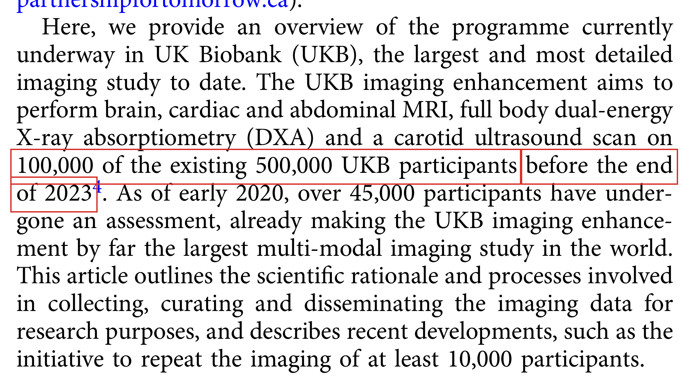

# Fact-Check Report

Checker: `claude -p · claude-opus-5[1m]` · PaperTrace · 2026-08-30
Manuscript: `demo_manuscript.pdf` · Sources: `3 / 4` cited references available

**Claims:** 5 | ✅ **Supported:** 2 | ⚠️ **Partial:** 0 | ❌ **Contradicted:** 2 | ⊘ **Not retrieved:** 1
**Citation coverage:** 5/5 citation occurrences reached by an extracted claim, across 4 labels — 0 unaddressed, 0 uncertain. Coverage counts places an extracted claim *reached*, not sources that were read.

> Ingest `converter: docling 2.118.1` — layout-aware.

> ⚠️ How to read that figure: attribution is a text match that can be wrong — deciding which citation a claim came from is a text comparison, so the counts can be right while a pointer is wrong. An attribution the tool cannot make counts as NOT covered, never as covered — and it refuses close calls, so two similar sentences citing one reference can both read as unaddressed where a reader would pair them at a glance. This figure understates coverage there. A sentence citing the same reference twice needs two extracted claims, so the ratio is not comparable between papers. And detection still reads bracketed numeric markers only — a citation style it cannot see contributes no occurrences at all, which makes this ratio look better than reality, not worse.

---

## Claim 1: "Deep learning on frontal chest radiographs detected type 2 diabetes with an external validation AUC of 0.94."

**Status:** ❌ CONTRADICTED
**Location:** Background ¶1 · cites [1]
 

### ❌ CONTRADICTED — `pyrros-2023` (cited as [1])

- **Source:** Page 4 `(block_0094)` 
> The source does detect T2D from frontal CXRs with deep learning, but its external validation at a separate institution gave a ROC AUC of 0.77, not 0.94 (internal prospective AUC was 0.84).

*red box = matched text*
## Claim 3: "The UK Biobank cohort profile describes recruitment of approximately 500,000 adults aged 40-69 years."

**Status:** ✅ SUPPORTED
**Location:** Population imaging ¶1 · cites [2]
 

### ✅ SUPPORTED — `sudlow-2015` (cited as [2])

- **Source:** Page 1 `(block_0006)` 
> The source states UK Biobank has over 500,000 participants aged 40–69 years recruited in 2006–2010, matching both the size and age range claimed.

*red box = matched text*
## Claim 4: "The UK Biobank imaging enhancement targets 100,000 participants."

**Status:** ✅ SUPPORTED
**Location:** Population imaging ¶1 · cites [3]
 

### ✅ SUPPORTED — `littlejohns-2020` (cited as [3])

- **Source:** Page 2 `(block_0013)` 
> The source states the imaging enhancement aims to scan 100,000 of the 500,000 existing UK Biobank participants.

*red box = matched text*
## Claim 5: "Nearly one in five confirmed participants had not attended an imaging assessment centre."

**Status:** ❌ CONTRADICTED
**Location:** Population imaging ¶1 · cites [3]
 

### ❌ CONTRADICTED — `littlejohns-2020` (cited as [3])

- **Source:** Page 3 `(block_0027)` 
> Among confirmed participants the source reports 97% attended and only 3% have not yet attended, not nearly one in five; the 17% figure applies to invited participants who did not wish to attend, not to confirmed ones.

*red box = matched text*
---

## Not verified — source not retrieved, or check failed (1 of 5)

Either the cited PDF could not be obtained, or the source was available but
the check step failed (see each note).
Reported as such — never filled in from memory.

- **Background** (1):
  - [4] Regulators are clearing AI systems for clinical imaging use at an accelerating pace. — *cited source not available (paywalled)*
## Assertions without citation (1) — your judgement required

Statements that would normally carry a reference but don't. Not verified —
flagged for you to weigh.

- **[U1]** Routine imaging archives are among the largest untapped screening resources in medicine. *(Background ¶1)*
## Literature scout — what the reference list doesn't know

> ⚠️ Scout scan incomplete: paper not identified in Europe PMC — pass --doi to pin it (title heuristics can miss)

*Search-based (Europe PMC) — absence from these lists
proves nothing, and presence is a candidate for your judgement, not an accusation.*

## Retrieval manifest

| # | Reference | Status | Via | Note |
|---|-----------|--------|-----|------|
| 1 | Pyrros A, Borstelmann SM, Mantravadi R, et al (2023) Opportunistic detection of … | retrieved | unpaywall | open-access copy via Unpaywall |
| 2 | Sudlow C, Gallacher J, Allen N, et al (2015) UK Biobank: An Open Access Resource… | retrieved | unpaywall | open-access copy via Unpaywall |
| 3 | Littlejohns TJ, Holliday J, Gibson LM, et al (2020) The UK Biobank imaging enhan… | retrieved | unpaywall | open-access copy via Unpaywall |
| 4 | Rajpurkar P, Lungren MP (2023) The Current and Future State of AI Interpretation… | paywalled | — | DOI resolved but no legal open-access copy found |

---

*Generated by [PaperTrace](https://github.com/defraction0/PaperTrace).
Evidence images are pages of the cited sources. The judgement is yours —
verify the flagged items before you rely on them.*