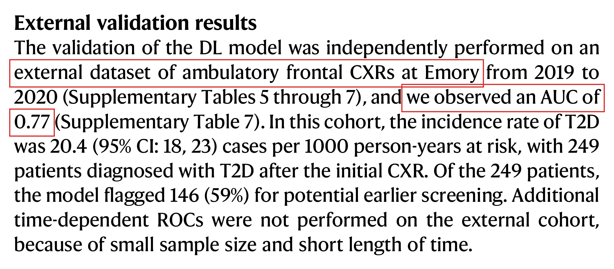
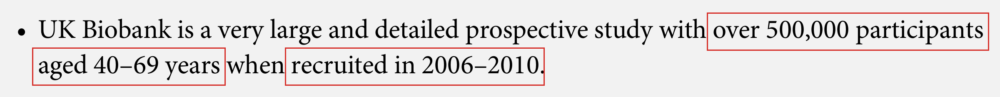
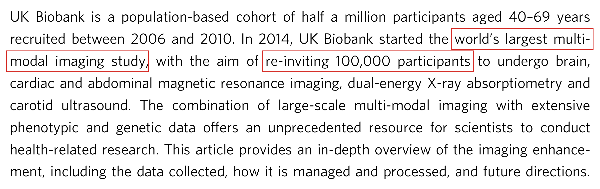
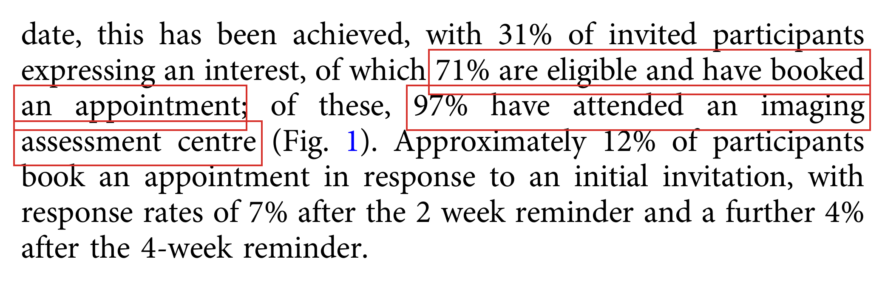

# Fact-Check Report

Checker: `Claude` · PaperTrace · 2026-08-16
Manuscript: `demo_manuscript.pdf` · Sources: `3 / 4` cited references available

**Claims:** 5 | ✅ **Supported:** 2 | ⚠️ **Partial:** 0 | ❌ **Contradicted:** 2 | ⊘ **Not retrieved:** 1
**Citation coverage:** all 4 citation labels covered ✓

---

## Claim 1: "Deep learning on frontal chest radiographs detected type 2 diabetes with an external validation AUC of 0.94."

**Status:** ❌ CONTRADICTED
**Location:** Background ¶1 · cites [1]
### Evidence from: `pyrros-2023`

- **Source:** Page 4 `(block_0094)` 

*red box = matched text*

> The source reports an external validation ROC AUC of 0.77 (Emory cohort), not 0.94; even the internal prospective test AUC was only 0.84.

## Claim 3: "The UK Biobank cohort profile describes recruitment of approximately 500,000 adults aged 40-69 years."

**Status:** ✅ SUPPORTED
**Location:** Population imaging ¶1 · cites [2]
### Evidence from: `sudlow-2015`

- **Source:** Page 1 `(block_0006)` 

*red box = matched text*

> The summary states UK Biobank recruited over 500,000 participants aged 40–69 years in 2006–2010, matching the claim's cohort size and age range.

## Claim 4: "The UK Biobank imaging enhancement targets 100,000 participants."

**Status:** ✅ SUPPORTED
**Location:** Population imaging ¶1 · cites [3]
### Evidence from: `littlejohns-2020`

- **Source:** Page 1 `(block_0004)` 

*red box = matched text*

> The abstract states the imaging study aims to re-invite 100,000 participants for multi-modal imaging, and this target is repeated throughout the paper.

## Claim 5: "Nearly one in five confirmed participants had not attended an imaging assessment centre."

**Status:** ❌ CONTRADICTED
**Location:** Population imaging ¶1 · cites [3]
### Evidence from: `littlejohns-2020`

- **Source:** Page 3 `(block_0027)` 

*red box = matched text*

> The source says 97% of confirmed, eligible participants who booked an appointment attended an imaging assessment centre — only 3% had not yet attended, not nearly one in five. The ~29% figure in the flow chart refers to confirmed participants ineligible after pre-screen, not non-attendance.

---

## Not verified — source not retrieved, or check failed (1 of 5)

Either the cited PDF could not be obtained, or the source was available but
the check step failed (see each note).
Reported as such — never filled in from memory.

- **Background** (1):
  - [4] Regulators are clearing AI systems for clinical imaging use at an accelerating pace. — *cited source not available (paywalled)*
## Assertions without citation (1) — your judgement required

Statements that would normally carry a reference but don't. Not verified —
flagged for you to weigh.

- **[U1]** Routine imaging archives are among the largest untapped screening resources in medicine. *(Background ¶1)*
## Literature scout — what the reference list doesn't know

> ⚠️ Scout scan incomplete: paper not identified in Europe PMC — pass --doi to pin it (title heuristics can miss)

*Search-based (Europe PMC) — absence from these lists
proves nothing, and presence is a candidate for your judgement, not an accusation.*

## Retrieval manifest

| # | Reference | Status | Via | Note |
|---|-----------|--------|-----|------|
| 1 | Pyrros A, Borstelmann SM, Mantravadi R, et al (2023) Opportunistic detection of … | retrieved | unpaywall | open-access copy via Unpaywall |
| 2 | Sudlow C, Gallacher J, Allen N, et al (2015) UK Biobank: An Open Access Resource… | retrieved | unpaywall | open-access copy via Unpaywall |
| 3 | Littlejohns TJ, Holliday J, Gibson LM, et al (2020) The UK Biobank imaging enhan… | retrieved | unpaywall | open-access copy via Unpaywall |
| 4 | Rajpurkar P, Lungren MP (2023) The Current and Future State of AI Interpretation… | paywalled | — | DOI resolved but no legal open-access copy found |

---

*Generated by [PaperTrace](https://github.com/defraction0/PaperTrace).
Evidence images are pages of the cited sources. The judgement is yours —
verify the flagged items before you rely on them.*