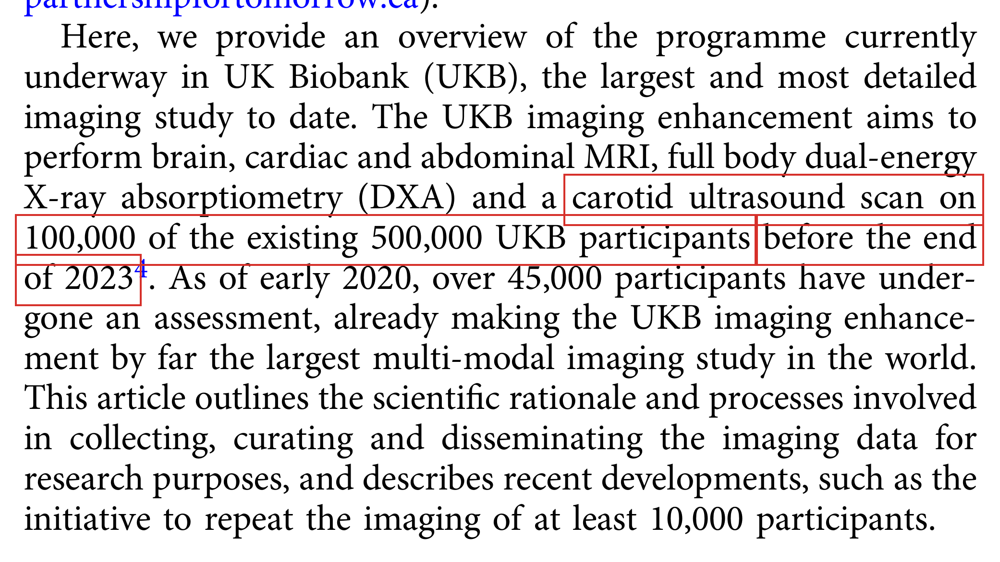
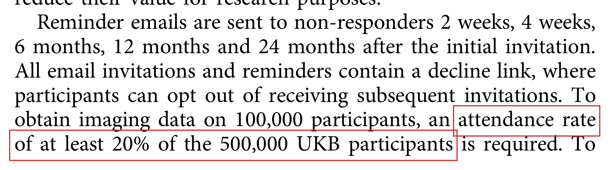

# Fact-Check Report

Checker: `claude -p · claude-opus-5` · PaperTrace · 2026-09-06
Manuscript: `demo_manuscript.pdf` · Sources: `3 / 4` cited references available

**Claims:** 4 | ✅ **Supported:** 1 | ⚠️ **Partial:** 0 | ❌ **Contradicted:** 2 | ⊘ **Not retrieved:** 1
**Citation coverage:** 5/5 citation occurrences reached by an extracted claim, across 4 labels — 0 unaddressed, 0 uncertain. Coverage counts places an extracted claim *reached*, not sources that were read.

> Ingest `converter: docling 2.118.1` — layout-aware.

> ⚠️ How to read that figure: attribution is a text match that can be wrong — deciding which citation a claim came from is a text comparison, so the counts can be right while a pointer is wrong. An attribution the tool cannot make counts as NOT covered, never as covered — and it refuses close calls, so two similar sentences citing one reference can both read as unaddressed where a reader would pair them at a glance. This figure understates coverage there. A sentence citing the same reference twice needs two extracted claims, so the ratio is not comparable between papers. And detection still reads bracketed numeric markers only — a citation style it cannot see contributes no occurrences at all, which makes this ratio look better than reality, not worse.

---

## Claim 1: "Deep learning on frontal chest radiographs detected type 2 diabetes with external validation AUC of 0.94."

**Status:** ❌ CONTRADICTED
**Location:** Background ¶1 · cites [1]

> Deep learning applied to frontal chest radiographs detected type 2 diabetes with an external validation AUC of 0.94 [1].

 

### ❌ CONTRADICTED — `pyrros-2023` (cited as [1])

- **Source:** Page 4 `(block_0050)` 
> The source reports external validation at a distinct institution yielding a ROC AUC of 0.77, not 0.94 (internal prospective AUC was 0.84); no 0.94 figure appears anywhere.

*red box = matched text*
## Claim 3: "UK Biobank recruited approximately 500,000 adults aged 40-69 years, and its imaging enhancement targets 100,000 participants."

**Status:** ✅ SUPPORTED — *most adverse of 2 cited sources*
**Location:** Population imaging ¶1 · cites [2, 3]

> Dedicated cohorts complement such opportunistic reuse: the UK Biobank cohort profile describes recruitment of approximately 500,000 adults aged 40-69 years [2], and its imaging enhancement targets 100,000 participants [3].

> **2 cited sources checked for this claim: 2 fully support it.**

 

### ✅ SUPPORTED — `sudlow-2015` (cited as [2])

- **Source:** Page 1 `(block_0018)` 
> The source states the cohort has "over 500,000 participants aged 40 -69 years when recruited in 2006 -2010", and separately reports multi-modal imaging in a subset of 100,000 participants (block_0038, block_0054).

*red box = matched text*
 

### ✅ SUPPORTED — `littlejohns-2020` (cited as [3])

- **Source:** Page 2 `(block_0013)` 
> The source states UK Biobank is a cohort of half a million participants aged 40-69 and that the imaging enhancement aims to image 100,000 of the existing 500,000 participants.

*red box = matched text*
## Claim 4: "Nearly one in five confirmed UK Biobank participants had not attended an imaging assessment centre."

**Status:** ❌ CONTRADICTED
**Location:** Population imaging ¶1 · cites [3]

> Attendance logistics remain a bottleneck, however - nearly one in five confirmed participants had not attended an imaging assessment centre [3].

 

### ❌ CONTRADICTED — `littlejohns-2020` (cited as [3])

- **Source:** Page 3 `(block_0023)` 
> The source reports that of those eligible who booked an appointment, 97% attended an imaging assessment centre, i.e. ~3% non-attendance, not nearly one in five; the ~20% figure in the source is the attendance rate of the full 500,000 cohort required to reach 100,000 scans.

*red box = matched text*
---

## Not verified — source not retrieved, or check failed (1 of 4)

Either the cited PDF could not be obtained, or the source was available but
the check step failed (see each note).
Reported as such — never filled in from memory.

- **Background** (1):
  - ⊘ NOT RETRIEVED · [4] Regulatory clearance of AI systems for clinical imaging is accelerating. — *cited source not available (paywalled)*

## Assertions without citation (1) — your judgement required

Statements that would normally carry a reference but don't. Not verified —
flagged for you to weigh.

- **[U1]** Routine imaging archives are among the largest untapped screening resources in medicine. *(Background ¶1)*
## Literature scout — what the reference list doesn't know

> ⚠️ Scout scan incomplete: paper not identified in Europe PMC — pass --doi to pin it (title heuristics can miss)

*Search-based (Europe PMC) — absence from these lists
proves nothing, and presence is a candidate for your judgement, not an accusation.*

## Retrieval manifest

| # | Reference | Status | Via | Note |
|---|-----------|--------|-----|------|
| 1 | Pyrros A, Borstelmann SM, Mantravadi R, et al (2023) Opportunistic detection of … | retrieved | unpaywall | open-access copy via Unpaywall · title check: 11/11 reference tokens on its first page |
| 2 | Sudlow C, Gallacher J, Allen N, et al (2015) UK Biobank: An Open Access Resource… | retrieved | unpaywall | open-access copy via Unpaywall · title check: 12/12 reference tokens on its first page |
| 3 | Littlejohns TJ, Holliday J, Gibson LM, et al (2020) The UK Biobank imaging enhan… | retrieved | unpaywall | open-access copy via Unpaywall · title check: 12/12 reference tokens on its first page |
| 4 | Rajpurkar P, Lungren MP (2023) The Current and Future State of AI Interpretation… | paywalled | — | DOI resolved but no legal open-access copy found |

---

*Generated by [PaperTrace](https://github.com/defraction0/PaperTrace).
Evidence images are pages of the cited sources. The judgement is yours —
verify the flagged items before you rely on them.*